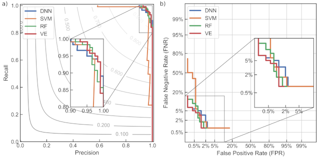

# PSS-ML2
Machine learning for power system transient stability assessment
---

**Dataset**

Dataset is deposited on zenodo: [Power System Transient Stability Assessment Simulations Dataset - IEEE New England 39-bus test case](https://www.zenodo.org/record/4521886) DOI: 10.5281/zenodo.4521886

Dataset contains phasor measurements (PMU) signals from the **IEEE New England 39-bus power system test case** network, which are generated from a large corpus of systematic MATLAB®/Simulink electro-mechanical transients simulations. Different load and generation levels of the New England 39-bus benchmark power system are systematically covered, as well as all three major types of short-circuit events. Dataset contains time-domain signals from 9360 different simulations.

**ML Models**

Jupyter Notebook rendered on nbviewer: [PSS-ML2](https://nbviewer.jupyter.org/github/sarajcev/PSS-ML2/blob/main/PSStabML2.ipynb)

Undercomplete denoising stacked autoencoder for the unsupervised dimensionality reduction of the features space. A deep neural network classifier from the pretrained autoencoder (with transfer learning from the encoder). A soft voting ensemble built from a support vector machine and a random forest classifiers. Ensemble weights obtained from solving a constrained optimization problem. Hyperparameters fine-tuning using a randomized search and the Bayesian optimization. Classifier calibration with precision-recall curves, receiver operating characteristic and detection error trade-off curves. Metrics include ROC-AUC score, F1 measure, Matthews correlation coefficient and Brier score.

Sarajcev, P.; Kunac, A.; Petrovic, G.; Despalatovic, M. Power System Transient Stability Assessment Using Stacked Autoencoder and Voting Ensemble. Energies 2021, 14, 3148. https://doi.org/10.3390/en14113148
